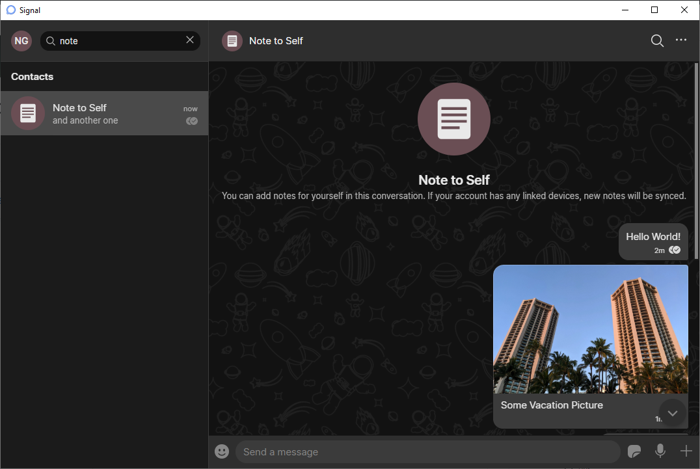
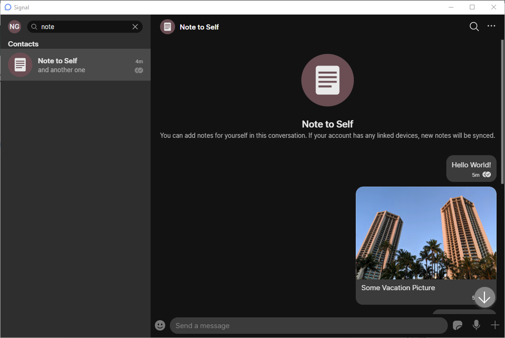
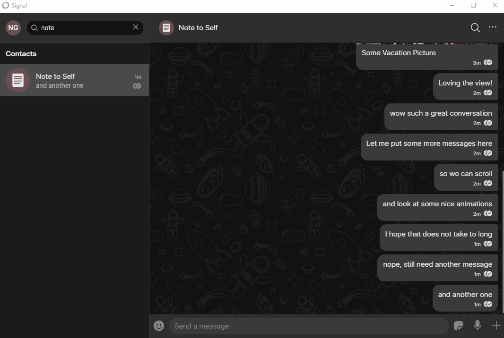
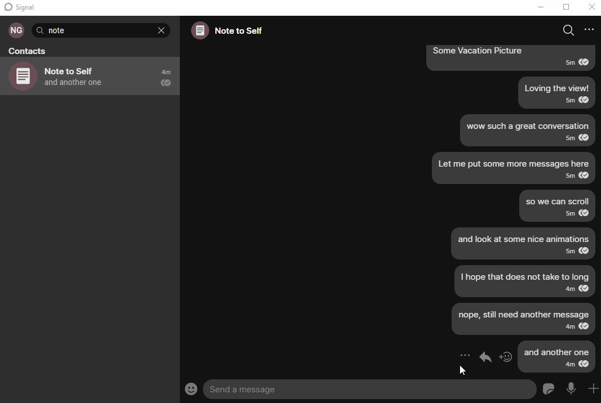

<!-- Copyright 2014-2020 Signal Messenger, LLC -->
<!-- SPDX-License-Identifier: AGPL-3.0-only -->

# Signal Desktop Retouched

This is a fork of the original Signal Desktop app which intends to provide a better and more modern user-interface. The original readme file is listed below. Note that the installation is **different**.

## Changes
A picture is worth a thousand words:
|    |  New | Old |
| ---| ---- | ---|
| UI |||
| Animations |  ||

But if you prefer words, here is a non-complete list of changes:
* Added [background image](https://pixabay.com/illustrations/seamless-pattern-kids-cosmonaut-5916873/)
* Increased header size
* Improved conversation view (messages are grouped by author)
* Animations for most popups
* Improved search consistency
* Color updates
* Delimiter in conversation list
* Updated scroll down button
* Properly centered avatars in search results
* Updated font size in avatars to align with mobile versions
* And a lot of tiny tweaks!

## Installation
### Binaries
The [release page](https://github.com/n-gao/Signal-Desktop-Retouched/releases) contains binaries for Windows. Since, I am solely using this client on Windows. If you are interested in other operating systems you have to building it [from source](#from-source).
### From source
To build it from source please refer to the [CONTRIBUTING.md](CONTRIBUTING.md) file.

## Drawbacks
Since this is not the official Signal client there are a number of compromises you have to deal with if you want to use this.
* Auto update is not available as it would override all changes to the default client
* You have to trust me that I know what I am doing

# Signal Desktop (original)

Signal Desktop is an Electron application that links with Signal
on [Android](https://github.com/signalapp/Signal-Android)
or [iOS](https://github.com/signalapp/Signal-iOS).

## Install the production version: https://signal.org/download/

## Install the beta

You can install the beta version of Signal Desktop alongside the production version. The beta uses different data and install locations.

- _Windows:_ First, download [this file](https://updates.signal.org/desktop/beta.yml) and look for the `url` property that specifies the location for the latest beta installer. Download the installer by constructing a final URL that looks like this: `https://updates.signal.org/desktop/<installer location>`. Then run the installer.
- _macOS:_ First, download [this file](https://updates.signal.org/desktop/beta-mac.yml) and look for the `url` property that specifies the location for the latest beta installer. Download the installer by constructing a final URL that looks like this: `https://updates.signal.org/desktop/<package location>`. Then unzip that package and copy the `.app` file into the `/Applications` folder using Finder.
- _Linux:_ Follow the production instructions to set up the APT repository and run `apt install signal-desktop-beta`.

## Got a question?

You can find answers to a number of frequently asked questions on our [support site](https://support.signal.org/).
The [community forum](https://community.signalusers.org/) is another good place for questions.

## Found a Bug? Have a feature request?

Please search for any [existing issues](https://github.com/signalapp/Signal-Desktop/issues) that describe your bug in order to avoid duplicate submissions.

## Contributing Translations

Interested in helping to translate Signal? Contribute here:

https://www.transifex.com/projects/p/signal-desktop

## Contributing Code

Please see [CONTRIBUTING.md](https://github.com/signalapp/Signal-Desktop/blob/master/CONTRIBUTING.md)
for setup instructions and guidelines for new contributors. Don't forget to sign the [CLA](https://signal.org/cla/).

## Contributing Funds

You can donate to Signal development through the [Signal Technology Foundation](https://signal.org/donate), an independent 501c3 nonprofit.

## Cryptography Notice

This distribution includes cryptographic software. The country in which you currently reside may have restrictions on the import, possession, use, and/or re-export to another country, of encryption software.
BEFORE using any encryption software, please check your country's laws, regulations and policies concerning the import, possession, or use, and re-export of encryption software, to see if this is permitted.
See <http://www.wassenaar.org/> for more information.

The U.S. Government Department of Commerce, Bureau of Industry and Security (BIS), has classified this software as Export Commodity Control Number (ECCN) 5D002.C.1, which includes information security software using or performing cryptographic functions with asymmetric algorithms.
The form and manner of this distribution makes it eligible for export under the License Exception ENC Technology Software Unrestricted (TSU) exception (see the BIS Export Administration Regulations, Section 740.13) for both object code and source code.

## License

Copyright 2013–2020 Signal, a 501c3 nonprofit

Licensed under the AGPLv3: https://opensource.org/licenses/agpl-3.0
